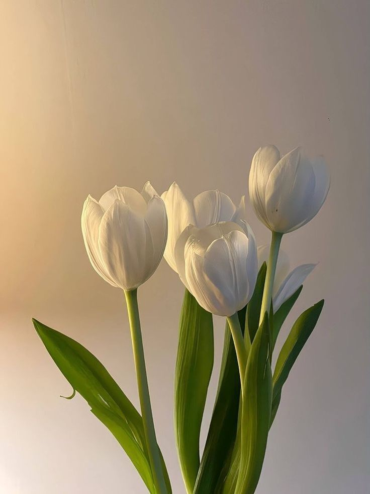
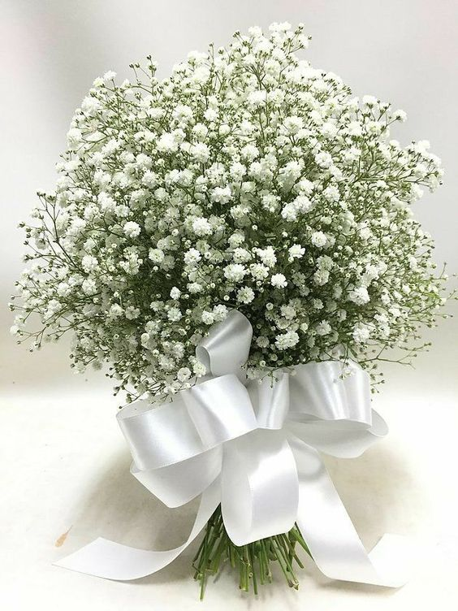

# nguyen.github.io
<html lang="vi">
<head>
<meta charset="utf-8">
<meta name="viewport" content="width=device-width, initial-scale=1.0">
<title>Vườn hoa</title>
<link rel="stylesheet" href="hoa.css">
</head>
<body>
	<header>
		

    	  
		

		<nav class="menu">
			<ul>
			  <li><a href="#">Trang chủ</a></li>
			  <li><a href="#">Giới thiệu</a></li>
				<li><a href="#">Sản phẩm</a></li>
			  <li><a href="#">Dịch vụ</a></li>
				<li><a href="#">Liên hệ</a></li>
			</ul>
		</nav>
	</header>
	

	

	

		<from action="/search" method="GET">
			<input type="text" name="query" placeholder="Tìm kiếm bài viết...">
			<button type="submit">Tìm kiếm</button>
</from>

<h2>BÀI VIẾT HIỆN TẠI</h2>

      
		
 - Hoa tuy-líp (bắt nguồn từ từ tiếng Pháp Tulipe),còn được viết là tulip theo tiếng Anh,còn có tên gọi khác là uất kim hương,là một chi thực vật có hoa trong họ Liliaceae.

		
		
 - Hướng Dương hay còn gọi là Hướng Nhật Quỳ,Quỳ Tử,Quỳ Hoa Tử,là loài hoa thuộc họ Cúc (Asteraceae),có tên khoa học là Helianthus Annuus.

	    
		
 - Gypsophila là một chi thực vật có hoa trong họ Caryophyllaceae.

		
		
 - Các loài Tulip vốn có nguồn gốc ở vùng Trung Đông, được đưa vào châu Âu vào thế kỷ XVI, từ Đế chế Ottoman (Thổ Nhĩ Kì ngày nay) và rất được ưa thích tại Hà Lan lúc bấy giờ và nó cũng chính là nguyên nhân gây ra việc đầu cơ củ tulip khi cầu vượt cung, "Hội chứng hoa tulip" là một thuật ngữ kinh tế ra đời sau thời kỳ bong bóng đầu cơ hoa tulip tan vỡ. Hiện nay hoa tulip được trồng ở khắp nơi trên thế giới. Hà Lan nổi tiếng là nước xuất khẩu hoa Tulip và có nhiều phong cảnh cánh đồng hoa tuyệt đẹp.  - Có khoảng 150 loài đang phát triển tại Bắc Phi và châu Âu đến Trung Á và Đông Á. Nhiều giống lai được sử dụng làm cây cảnh ở các công viên và các khu vườn cũng như hoa cắt để trang trí.
		  - Mùa hoa nở thường là vào tháng 4 đến tháng 5.

	
		<footer>
		
Copyright Nguyễn Trần Anh Nguyên

		
Lớp QT22TC3.6

		</footer>
</body>
</html>
